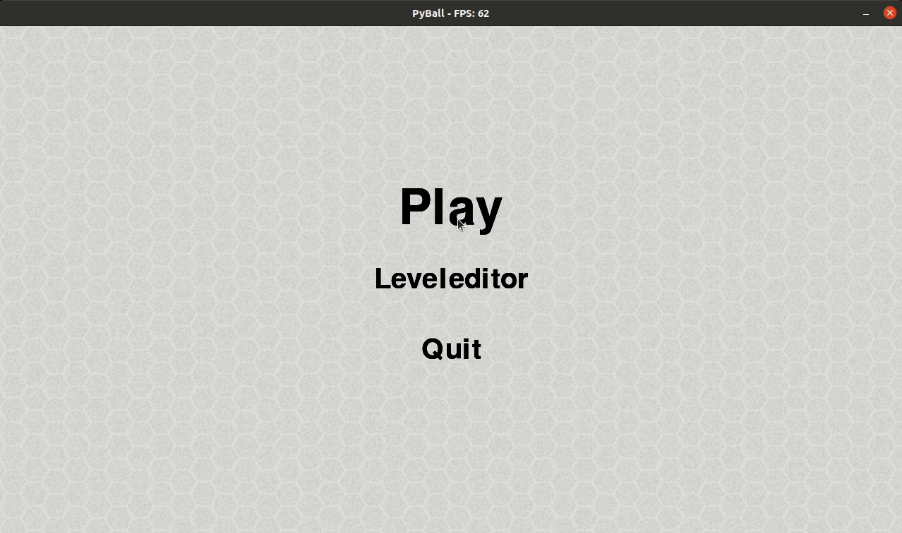

# pyball
A simple (unfinished) `SMO Arena Fighter` clone written with `pygame`. The Project was mainly done for fun at the CCC Camp 2015.

- [x] `pygame` is the only dependency: simply `pip3 install pygame && python3 main.py` to run the game
- [x] Local Multiplayer
- [x] Level Editor
- [x] Basic Weapon and Nade Implementation
- [x] Efficient collision detection using quadtree
- [ ] More weapons
- [ ] Character customization
- [ ] AI bot for single player mode
- [ ] Some code cleanups

How it looks like (sry for the laggy gif):

